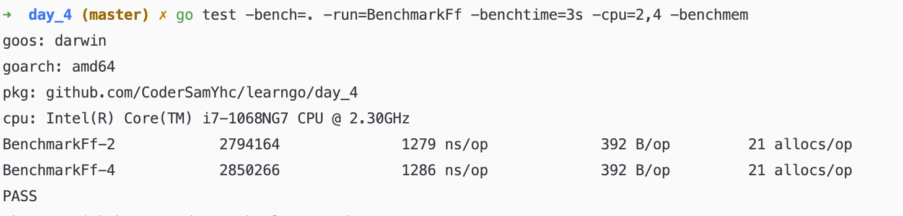

# LEARN-GO

---

> go学习计划

## DAY1

- [X] 指针
  - 值传递：copy 值，函数内部修改不会影响外部
  - 引用传递：传递值的地址，函数内修改会影响外部
- [X] 数组
  - 1、数组是值类型，调用函数是值传递；可以传指针数组，但一般不会这样使用，会使用切片
  - 2、[]int 这是切片 [1]int 这是数组
  - 3、函数传参定义[5]int 外部定义[...]int的值也必须是5个
  - 4、[5]int 和 [10]int 是不同的类型
- [X] 切片
  - 1、左开右闭 指定的最大索引不包含在结果集内
  - 2、切片是数组的一个视图，即切片是引用传递，函数内对其某个索引的值进行修改，会影响外部的值 
  - 3、切片包含 ptr、len、cap；len包含ptr，cap包含len和ptr
  - 4、切片可以向后扩展，不可以向前扩展；s[i]不可以超越len(s)，向后扩展不可以超越底层数组的cap(s)
  - 5、添加元素超过底层数组的cap(s)时，底层会开辟一个新的cap更大的新数组
- [X] 切片拓展
  - 1、空切片实际是nil；zero value for slice is nil；
- [X] Map
  - 1、key不存在时，获取value类型的初始值
  - 2、除了map、slice、function，其他内建类型都可以作为key，struct 不包含map、slice、function也可以作为key
  - 3、当使用float作为map的key时，由于float精度问题，会出现获取不到float key 对应 value 的情况，所以应该慎用 float 作为 key
- [X] Map例题

## DAY2
- [X] 包
  - 初始化顺序：main->import pkg->const->var->init() 返回main->const->var->init()->mian()
- [X] 接口
- [X] 接口拓展

## DAY3
- [X] goroutine
- [X] 锁
- [X] 管道
  - 1、对于关闭管道，向已关闭的管道发送数据会报panic，从已关闭的管道接收数据，返回已缓冲的数据或零值
  - 2、无论收发，nil管道都会阻塞
  - 3、重复关闭管道或关闭nil管道会引发panic
  - 4、单向管道不能逆向操作，也不能转换
  - 5、接收管道不能close

## DAY4

- [X] 性能测试
  - -benchmem（性能测试的时候显示测试函数的内存分配的统计信息，等价于在基准测试中调用b.ReportAllocs()）
  - -count=n（运行多少次，默认1次）
  - -timeout=t（超时时间，超过会panic，默认10分钟）
  - -cpu=x,y（指定GOMAXPROCS，可以通过,传入一个列表）
  - -benchtime=ns（指定执行时间(e.g. 2s)或具体次数(e.g. 10x)）
  - -cpuprofile=filename.out（输出cpu性能文件）
  - -memprofile=filename.out（输出mem内存性能文件）
  - 
  - BenchmarkFf-2（BenchmarkFf表示测试函数名 -2表示线程数）
  - 2794164（执行总次数）
  - 1279 ns/op（表示平均每次操作花费了1222纳秒）
  - 392 B/op（表示每次操作申请了392Byte的内存申请）
  - 21 allocs/op（表示每次操作申请了21次内存）
  
## DAY5
- [X] protobuf

  
  
